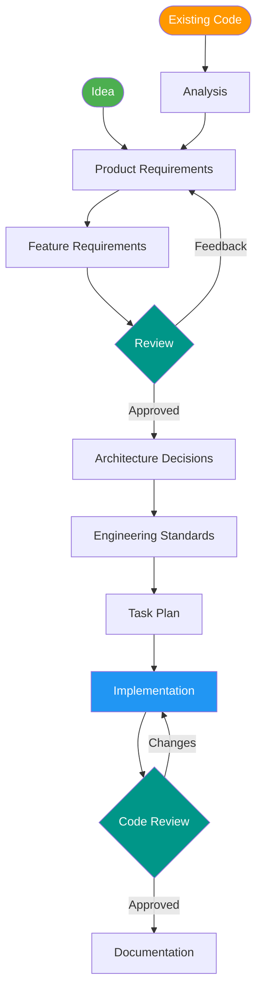

# Spec-to-Code

A VS Code template for **spec-driven software development** powered by GitHub Copilot agents. Instead of jumping straight into code, this template guides you through a structured workflow — define requirements, make architecture decisions, plan tasks, then implement — with specialized AI agents that enforce separation of concerns, human review gates, and a complete audit trail from business goal to shipped code.



All specifications, decisions, and task plans live in version-controlled Markdown under `specs/`. Seven agents collaborate through a delegation model — a **Program Manager** routes requests, a **Product Owner** defines requirements, a **Dev Lead** reviews, an **Architect** makes technology decisions, a **Developer** plans and implements, an **Analyst** onboards existing codebases, and a **Documenter** generates project docs.

## Quick Start

### Prerequisites

- [VS Code](https://code.visualstudio.com/) with [GitHub Copilot](https://marketplace.visualstudio.com/items?itemName=GitHub.copilot) and [GitHub Copilot Chat](https://marketplace.visualstudio.com/items?itemName=GitHub.copilot-chat)
- A GitHub Copilot subscription with agent mode enabled

### New Project

1. **Clone or use this repository as a template** for your new project.
2. **Open the folder in VS Code.**
3. **Start Copilot Chat in agent mode** and select the **pm** agent — it's the main entry point that delegates to the right agents.
4. **Describe your idea** — e.g., *"I want to build a task management app for small teams."*
5. **Follow the workflow** — the PM agent delegates to specialized agents in order. Review and approve at each stage.

### Existing Project

Open a terminal in your project root and run:

**macOS / Linux**
```bash
curl -sL https://github.com/dev-sr201d/spec-to-code/archive/refs/heads/main.tar.gz \
  | tar xz --strip-components=1 spec-to-code-main/.github spec-to-code-main/.vscode
```

**Windows (PowerShell)**
```powershell
irm https://github.com/dev-sr201d/spec-to-code/archive/refs/heads/main.zip -OutFile "$env:TEMP\stc.zip"
Expand-Archive "$env:TEMP\stc.zip" "$env:TEMP\stc" -Force
Copy-Item "$env:TEMP\stc\spec-to-code-main\.github", "$env:TEMP\stc\spec-to-code-main\.vscode" . -Recurse -Force
Remove-Item "$env:TEMP\stc.zip", "$env:TEMP\stc" -Recurse -Force
```

Then:

1. **Open the folder in VS Code.**
2. **Start Copilot Chat** and select the **analyst** agent, or use the `/analyze` prompt.
3. **Run the analysis** — the analyst reverse-engineers specs, ADRs, AGENTS.md, and documentation from your code.
4. **Triage issues** — the analyst generates `specs/issues.md`. Use the **lead** agent or `/triage` to classify issues before any refinement.
5. **Continue with the normal workflow** — refine specs with **po**, validate ADRs with **arch**, plan and implement with **dev**.

---

## Workflows

### New Project: Idea to Implementation

The full workflow takes an idea through requirements, architecture, planning, implementation, review, and documentation. Use the **pm** agent to orchestrate automatically, or drive each step manually with prompts.

**Orchestrated** — tell the PM agent your idea and it delegates each step:

```
@pm "Build a task management app for small teams"
```

The PM follows this sequence:

| Step | Agent | What Happens | Artifacts |
|------|-------|-------------|-----------|
| 1 | **po** | Gathers requirements, writes the PRD | `specs/prd.md` |
| 2 | **po** | Decomposes PRD into feature specs | `specs/features/*.md` |
| 3 | **lead** | Reviews specs for feasibility and completeness | Findings and recommendations |
| 4 | **arch** | Makes technology and architecture decisions | `specs/adr/*.md` |
| 5 | **arch** | Generates engineering standards from ADR choices | `AGENTS.md` |
| 6 | **arch** | Defines scaffolding infrastructure requirements | `specs/features/000-project-scaffolding.md` |
| 7 | **lead** | Reviews scaffolding requirements | Findings and recommendations |
| 8 | **dev** | Breaks features into ordered technical tasks | `specs/tasks/*.md` |
| 9 | **dev** | Implements each task with tests | Source code and tests |
| 10 | **lead** | Reviews code against acceptance criteria and standards | Verdict: approved or changes requested |
| 11 | **doc** | Generates project documentation | `docs/` |

Each delegation pauses for your confirmation before proceeding — no agent acts until you approve. This is controlled by the `send: false` setting on all agent handoffs, which presents the delegation as a proposal rather than auto-executing it. You can redirect, provide feedback, or skip steps at any point.

Feel free to change `send` settings on any handoff for more automation. For example, you might want to auto-approve the lead's code review to speed up implementation, or you might want to auto-generate ADRs from the architect without waiting for your review.

### Feature Refinement

When requirements change or review feedback needs to be incorporated:

```
/refine 001-user-authentication
```

The **po** agent updates the FRD, preserving existing requirement IDs and traceability. If the refinement changes scope, the PRD is updated to match. If tasks already exist for the feature, a reminder prompts you to re-plan.

### Manual Control: Plan, Review, Implement

For fine-grained control over individual steps, use prompts directly instead of going through the PM:

| Action | Prompt | Agent |
|--------|--------|-------|
| Plan tasks for a feature | `/plan 001-user-authentication` | dev |
| Implement a specific task | `/implement F001-T003-login-endpoint` | dev |
| Review specs before architecture | `/review-spec` | lead |
| Review code after implementation | `/review-code F001-T003-login-endpoint` | lead |
| Re-evaluate a past architecture decision | `/reconsider 002-database-choice` | arch |

The task plan produced by `/plan` includes a dependency graph. Tasks without shared dependencies can be implemented in parallel — invoke `/implement` for each one. Tasks with dependencies must be implemented in order.

### Documentation

Generate or update project documentation from specs, ADRs, and source code:

```
/doc
```

The **doc** agent produces documentation across three areas:

| Area | Path | Audience |
|------|------|----------|
| Architecture | `docs/architecture/` | Developers |
| Operations | `docs/operations/` | DevOps / SRE |
| Usage | `docs/usage/` | End users and integrators |

Documentation is source-derived — every statement traces back to a spec, ADR, or code file. The doc agent describes what the system *is*, never what it *should be*.

### Code Maintenance

Scan and update project dependencies:

```
/maintain
```

The **dev** agent scans for outdated, deprecated, and vulnerable packages, then:

- **Patches and minor updates** are applied automatically and validated by the full test suite.
- **Vulnerability fixes** are applied regardless of version bump size (security overrides stability).
- **Major version bumps and deprecated packages** are referred to the **arch** agent, who evaluates the change and updates the relevant ADR and `AGENTS.md` if needed.

Every maintenance run is logged in `docs/operations/maintenance-log.md` with what was scanned, updated, deferred, and tested. The **lead** agent reviews the final changes.

### Existing Codebase Onboarding

Reverse-engineer a codebase that already has code but lacks structured specs:

```
/analyze
```

The **analyst** agent performs a deep, multi-phase analysis:

1. **Discovery** — Scans every directory, dependency, config file, and test suite. Runs the build and tests. Audits security against OWASP Top 10. Cross-checks detected technologies against official documentation.
2. **Artifact generation** — Produces a PRD, FRDs, ADRs, and `AGENTS.md` that describe the system as it exists today.
3. **Issues manifest** — All findings (security gaps, outdated dependencies, missing tests, convention violations) go into `specs/issues.md` with severity, evidence, and source references.

After analysis, triage the issues before any other work:

```
/triage
```

The **lead** agent classifies each issue as `promote` (add to an existing FRD), `new-frd` (create a remediation feature), `accepted-debt`, `needs-investigation`, or `duplicate`. Only after triage can the **po** refine specs or the **dev** plan tasks.

---

## Agents

| Agent | Role | Description |
|-------|------|-------------|
| **pm** | Program Manager | Entry point for all requests. Analyzes intent and delegates to the right agent(s). Never writes code or specs directly. |
| **po** | Product Owner | Translates ideas into a PRD (`specs/prd.md`) and FRDs (`specs/features/`). Owns the *what*, never the *how*. |
| **lead** | Dev Lead | Reviews specs for feasibility, reviews code against acceptance criteria and standards, triages analyst issues. Read-only for specs and code — edits only `specs/issues.md`. |
| **arch** | Architect | Makes technology and architecture decisions as ADRs (`specs/adr/`). Generates `AGENTS.md` with coding standards. Defines scaffolding requirements. |
| **dev** | Developer | Plans tasks (`specs/tasks/`), implements code and tests following `AGENTS.md`, and maintains dependencies. |
| **analyst** | Analyst | Onboards existing codebases by reverse-engineering specs, ADRs, `AGENTS.md`, and documentation from code. |
| **doc** | Documenter | Creates and maintains project documentation in `docs/` — architecture, operations, and usage guides. |

## Skills

| Skill | Agent | Purpose |
|-------|-------|---------|
| **prd-skill** | po | Create or update the Product Requirements Document |
| **frd-skill** | po | Decompose the PRD into Feature Requirements Documents |
| **adr-skill** | arch | Create Architecture Decision Records (MADR format) |
| **standards-skill** | arch | Generate `AGENTS.md` engineering standards from ADRs |
| **scaffold-skill** | arch | Create the scaffolding FRD from ADR decisions |
| **plan-skill** | dev | Break FRDs into ordered, independent technical tasks |
| **implement-skill** | dev | Implement a task — write code and tests |
| **test-skill** | dev | Integration, E2E, and contract tests |
| **maintain-skill** | dev | Scan, classify, and apply dependency updates |
| **code-review-skill** | lead | Review code against acceptance criteria and standards |
| **spec-review-skill** | lead | Review specs for feasibility and completeness |
| **triage-skill** | lead | Triage the analyst's issues manifest |
| **analyze-skill** | analyst | Reverse-engineer a codebase into specs and standards |
| **doc-skill** | doc | Generate and maintain project documentation |

## Prompts

| Prompt | Agent | Action |
|--------|-------|--------|
| `/prd` | po | Create or update the PRD from a project idea |
| `/refine` | po | Refine an FRD based on feedback |
| `/reconsider` | arch | Re-evaluate an architecture decision |
| `/plan` | dev | Plan implementation tasks for a feature |
| `/implement` | dev | Implement a specific task |
| `/maintain` | dev | Scan and update dependencies |
| `/review-spec` | lead | Review specs for feasibility and completeness |
| `/review-code` | lead | Review implemented code |
| `/triage` | lead | Triage pending issues in `specs/issues.md` |
| `/analyze` | analyst | Reverse-engineer an existing codebase |
| `/doc` | doc | Create or update project documentation |

## Project Structure

```
.github/
├── agents/              # Agent definitions (pm, po, lead, arch, dev, analyst, doc)
├── copilot-instructions.md  # Global principles (SOLID, Zero Trust)
├── instructions/        # File-scoped conventions
│   ├── agents-md.instructions.md
│   ├── doc-files.instructions.md
│   ├── spec-files.instructions.md
│   └── task-files.instructions.md
├── prompts/             # Reusable prompt shortcuts
│   ├── analyze.prompt.md
│   ├── doc.prompt.md
│   ├── implement.prompt.md
│   ├── maintain.prompt.md
│   ├── plan.prompt.md
│   ├── prd.prompt.md
│   ├── reconsider.prompt.md
│   ├── refine.prompt.md
│   ├── review-code.prompt.md
│   ├── review-spec.prompt.md
│   └── triage.prompt.md
└── skills/              # Skill procedures with asset templates
    ├── adr-skill/
    ├── analyze-skill/
    ├── code-review-skill/
    ├── doc-skill/
    ├── frd-skill/
    ├── implement-skill/
    ├── maintain-skill/
    ├── plan-skill/
    ├── prd-skill/
    ├── scaffold-skill/
    ├── spec-review-skill/
    ├── standards-skill/
    ├── test-skill/
    └── triage-skill/
.vscode/
└── mcp.json             # MCP server configuration
specs/                   # Created during development
├── .analysis/           # Discovery phase reports (analyst)
├── prd.md               # Product Requirements Document
├── features/            # Feature Requirements Documents
├── adr/                 # Architecture Decision Records
├── tasks/               # Implementation task specifications
└── issues.md            # Analyst issues manifest (analyst → lead triage)
AGENTS.md                # Generated engineering standards
docs/                    # Generated project documentation
├── architecture/
├── operations/
└── usage/
```

## MCP Servers

Pre-configured [Model Context Protocol](https://modelcontextprotocol.io/) servers give agents access to live documentation:

| Server | Use For |
|--------|---------|
| **context7** | Library and framework API docs, configuration syntax, version-specific patterns |
| **mdn** | Web standards — HTML, CSS, JavaScript, browser APIs, compatibility data |
| **microsoft.docs.mcp** | .NET, Azure, TypeScript, and Microsoft ecosystem technologies |
| **deepwiki** | GitHub repository internals — how a specific open-source project works |
| **github** | GitHub API access for repository operations |

## Guiding Principles

All agents follow two core principles defined in [.github/copilot-instructions.md](.github/copilot-instructions.md):

- **SOLID** — Single Responsibility, Open/Closed, Liskov Substitution, Interface Segregation, Dependency Inversion
- **Zero Trust** — Validate all inputs, authenticate every request, least privilege, encrypt everything, fail securely

## Acknowledgements

This template was built upon the experience and lessons learned from the [spec2cloud](https://github.com/EmeaAppGbb/spec2cloud) repository.

## License

This template is provided as-is for use as a starting point for spec-driven development projects.
