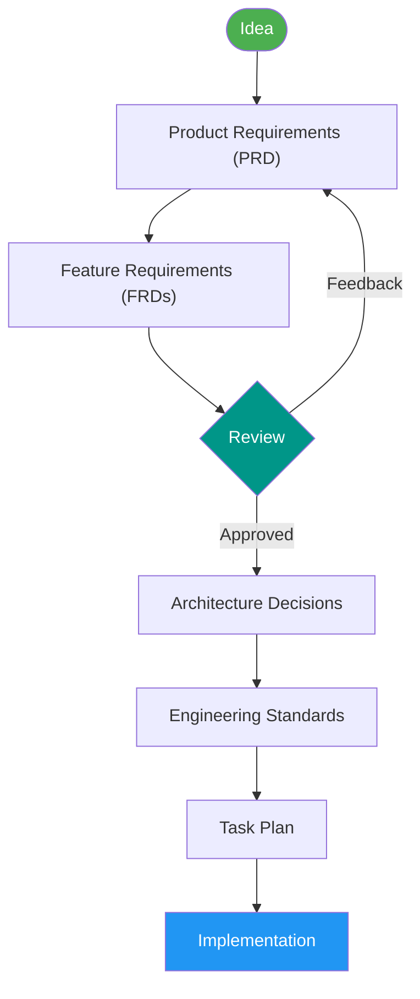

# Spec-to-Code

A VS Code template for **spec-driven software development** powered by GitHub Copilot agents. Instead of jumping straight into code, this template guides you through a structured workflow: define requirements, make architecture decisions, plan tasks, then implement — all with specialized AI agents.

## How It Works

You describe an idea. The agents turn it into a structured specification, make architecture decisions, plan the work, and implement it — step by step, with human review at every stage.



> **Product Owner** handles the requirements · **Dev Lead** reviews · **Architect** produces ADRs and AGENTS.md · **Developer** plans and implements

All specifications live in version-controlled Markdown files under `specs/`, giving you a complete audit trail from business goal to shipped code.

## Agents

Five specialized agents collaborate through a delegation model, each with a distinct role:

| Agent | Role | Description |
|-------|------|-------------|
| **pm** | Program Manager | Entry point for all requests. Analyzes intent and delegates to the right agent(s). Never writes code or specs directly. |
| **po** | Product Owner | Translates ideas into a Product Requirement Document (PRD) (`specs/prd.md`) and breaks it into Feature Requirements Documents (FRDs) (`specs/features/`). Owns the *what*, never the *how*. |
| **lead** | Dev Lead | Reviews PRDs and FRDs for technical feasibility, completeness, and missing requirements. Read-only — produces findings and recommendations, never edits specs. |
| **arch** | Architect | Makes technology and architecture decisions, documented as ADRs (`specs/adr/`). Generates `AGENTS.md` with coding standards for the chosen stack. |
| **dev** | Developer | Plans implementation tasks (`specs/tasks/`) and writes code and tests following `AGENTS.md` guidelines and ADR decisions. |

## Skills

Each agent uses focused skills that define repeatable procedures:

| Skill | Used By | Purpose |
|-------|---------|---------|
| **prd-skill** | po | Create or update the Product Requirements Document (PRD) |
| **frd-skill** | po | Decompose the PRD into individual Feature Requirements Documents (FRDs) |
| **adr-skill** | arch | Create Architecture Decision Records (MADR format) with researched options |
| **standards-skill** | arch | Generate `AGENTS.md` engineering standards from ADR technology choices |
| **plan-skill** | dev | Break FRDs into ordered, independent technical tasks |
| **implement-skill** | dev | Implement a task — write code and tests following project standards |

## Reusable Prompts

Shortcut prompts for common actions users may want to invoke manually, available via VS Code's prompt palette:

| Prompt | Agent | Action |
|--------|-------|--------|
| `/refine` | po | Refine an FRD based on feedback or changed requirements |
| `/reconsider` | arch | Re-evaluate an architecture decision with new information |
| `/plan` | dev | Plan implementation tasks for a feature |
| `/implement` | dev | Implement a specific task from `specs/tasks/` |

## Quick Start

### Prerequisites

- [VS Code](https://code.visualstudio.com/) with [GitHub Copilot](https://marketplace.visualstudio.com/items?itemName=GitHub.copilot) and [GitHub Copilot Chat](https://marketplace.visualstudio.com/items?itemName=GitHub.copilot-chat)
- A GitHub Copilot subscription with agent mode enabled

### Using the Template

1. **Clone or use this repository as a template** for your new project.
2. **Open the folder in VS Code.**
3. **Start Copilot Chat in agent mode** and select the **pm** agent — it's the main entry point that delegates to the other agents.
4. **Describe your idea** — e.g., *"I want to build a task management app for small teams."*
5. **Follow the workflow** — the PM agent will delegate to the right agents in order.

### Typical Workflow

```
1.  @pm "Build a task management app for small teams"
2.  PM delegates to PO → PRD created in specs/prd.md
3.  PM delegates to PO → FRDs created in specs/features/
4.  PM delegates to Lead → Technical review of specs
5.  PM delegates to Arch → ADRs created in specs/adr/
6.  PM delegates to Arch → AGENTS.md generated with coding standards
7.  PM delegates to Dev → Task plan created in specs/tasks/
8.  PM delegates to Dev → Tasks implemented with tests
```

You can also use prompts for refinement, reconsiderations, planning, and implementation directly for more control:
- `/plan 001-user-authentication` — plan tasks for a specific feature (routes to **dev**)
- `/implement 003-api-endpoints` — implement a specific task (routes to **dev**)
- `/refine 001-user-authentication` — update an FRD after feedback (routes to **po**)
- `/reconsider 002-database-choice` — re-evaluate a past decision (routes to **arch**)

## Project Structure

```
.github/
├── agents/              # Agent definitions (pm, po, lead, arch, dev)
├── copilot-instructions.md  # Global principles (SOLID, Zero Trust)
├── instructions/        # File-scoped conventions
│   ├── spec-files.instructions.md    # Rules for specs/**/*.md
│   └── task-files.instructions.md    # Rules for specs/tasks/**
├── prompts/             # Reusable prompt templates
│   ├── implement.prompt.md
│   ├── plan.prompt.md
│   ├── reconsider.prompt.md
│   └── refine.prompt.md
└── skills/              # Skill procedures with asset templates
    ├── adr-skill/       # ADR creation (MADR template)
    ├── frd-skill/       # FRD creation (feature template)
    ├── implement-skill/ # Code implementation
    ├── plan-skill/      # Task planning (task template)
    ├── prd-skill/       # PRD creation (PRD template)
    └── standards-skill/ # AGENTS.md generation (standards template)
.vscode/
└── mcp.json             # MCP server configuration
specs/                   # Created during development
├── prd.md               # Product Requirements Document
├── features/            # Feature Requirements Documents
├── adr/                 # Architecture Decision Records
└── tasks/               # Implementation task specifications
AGENTS.md                # Generated engineering standards
```

## MCP Servers

The template includes pre-configured [Model Context Protocol](https://modelcontextprotocol.io/) servers that give agents access to live documentation:

| Server | Purpose |
|--------|---------|
| **context7** | Library and framework documentation lookup |
| **github** | GitHub API access for repository operations |
| **microsoft.docs.mcp** | Microsoft Learn / Azure documentation |
| **deepwiki** | AI-powered documentation for GitHub repositories |
| **mdn** | MDN Web Docs for web standards reference |

## Guiding Principles

All agents follow two core principles defined in [.github/copilot-instructions.md](.github/copilot-instructions.md):

- **SOLID** — Single Responsibility, Open/Closed, Liskov Substitution, Interface Segregation, Dependency Inversion
- **Zero Trust** — Validate all inputs, authenticate every request, least privilege, encrypt everything, fail securely

## Acknowledgements

This template was built upon the experience and lessons learned from the [spec2cloud](https://github.com/EmeaGbb/spec2cloud) repository.

## License

This template is provided as-is for use as a starting point for spec-driven development projects.
